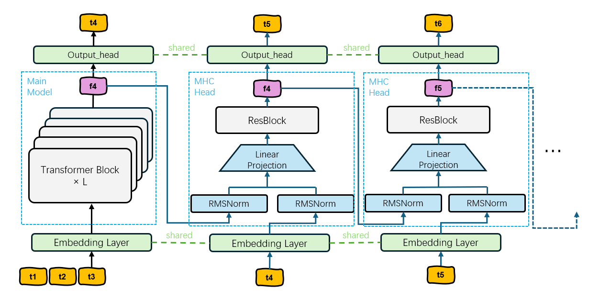

# MHC: Multi-Head-Casual Language Model

## Introduction

MHC (Multi-Head-Casual) is a speculative decoding acceleration framework based on multi-decoding heads. Unlike traditional multi-head decoding methods, MHC introduces a causal mechanism between consecutive decoding heads, achieving more efficient parallel inference.



### Core Features

- **Causal Multi-Head Decoding**: Each decoding head depends on the hidden layer output and output token embedding vectors from the previous decoding head
- **Cascade Dependency Design**: Combines the output of the previous head with the input of the current head through concat operations, processed through dimension transformation and residual layers
- **Efficient Inference**: Achieves faster inference than traditional autoregressive decoding through tree attention mechanisms and candidate verification
- **Strong Compatibility**: Supports mainstream language models such as Vicuna and Mistral

### Architecture Features

```
Input → Base Model → Hidden State
                      ↓
Head1: Hidden State → ResBlock → Output1
                      ↓
Head2: [Hidden State + Output1 Embedding] → ResBlock → Output2
                      ↓
Head3: [Hidden State + Output2 Embedding] → ResBlock → Output3
                      ↓
                     ...
```

Each MHC head processes through the following steps:
1. Concatenate the hidden state and output token embedding from the previous head
2. Adjust to appropriate hidden size through dimension transformation layer
3. Process through multiple ResBlock residual layers
4. Output predicted token for current position

## Installation

### Environment Requirements

- Python 3.8+
- PyTorch 2.0+
- CUDA 11.8+
- transformers >= 4.28.0

### Installation Steps

1. Clone the project:
```bash
git clone https://github.com/YuanlinChu/Multi-head-causal-decoding.git
cd Multi-head-causal-decoding
```

2. Install dependencies:
```bash
pip install torch transformers accelerate deepspeed
pip install fastchat wandb tqdm shortuuid
pip install safetensors huggingface_hub
```

3. Install optional dependencies:
```bash
pip install bitsandbytes  # For 4bit/8bit quantization
```

## Training

### Data Preparation

1. Prepare training data (ShareGPT format):
```bash
# Download ShareGPT dataset
git clone https://huggingface.co/datasets/Aeala/ShareGPT_Vicuna_unfiltered
```

2. Data preprocessing:
```bash
python data/create_data.py --input-filename ShareGPT_Vicuna_unfiltered/ShareGPT_V4.3_unfiltered_cleaned_split.json --output-filename data/ShareGPT.json
```

### Single GPU Training

```bash
python train.py \
    --model_name_or_path lmsys/vicuna-7b-v1.3 \
    --data_path data/ShareGPT.json \
    --output_dir ./output_mhc \
    --mhc_num_heads 5 \
    --res_layer_nums 1 \
    --bf16 True \
    --num_train_epochs 4 \
    --per_device_train_batch_size 8 \
    --gradient_accumulation_steps 4 \
    --learning_rate 1e-3 \
    --weight_decay 0.0 \
    --lr_scheduler_type cosine \
    --warmup_ratio 0.1 \
    --logging_steps 1 \
    --save_steps 1000 \
    --model_max_length 2048 \
    --lazy_preprocess True
```

### Multi-GPU Training (Recommended)

Use DeepSpeed for multi-GPU training:

```bash
torchrun --nproc_per_node=4 train.py \
    --model_name_or_path lmsys/vicuna-7b-v1.3 \
    --data_path data/ShareGPT.json \
    --output_dir ./output_mhc \
    --mhc_num_heads 5 \
    --res_layer_nums 1 \
    --bf16 True \
    --num_train_epochs 4 \
    --per_device_train_batch_size 8 \
    --gradient_accumulation_steps 4 \
    --learning_rate 1e-3 \
    --weight_decay 0.0 \
    --lr_scheduler_type cosine \
    --warmup_ratio 0.1 \
    --logging_steps 1 \
    --save_steps 1000 \
    --model_max_length 2048 \
    --lazy_preprocess True \
    --deepspeed deepspeed.json
```

### Training Parameters Explanation

- `--mhc_num_heads`: Number of MHC heads, default 5
- `--res_layer_nums`: Number of residual layers per MHC head, default 1
- `--learning_rate`: Learning rate, recommended 1e-3 (since only training new heads)
- `--deepspeed`: DeepSpeed configuration file path

## Inference

### Command Line Chat

Start interactive command line interface:

```bash
python cli.py --model <model_path>
```

Example:
```bash
python cli.py --model ./output_mhc/checkpoint-2000
```

### Inference Parameters

```bash
python cli.py \
    --model ./output_mhc/checkpoint-2000 \
    --temperature 0.0 \
    --max_steps 512 \
    --load-in-8bit  # Optional: 8bit quantization
```

### Command Line Interactive Commands

The following commands are available in the chat interface:
- `!!exit` or empty line: Exit the program
- `!!reset`: Reset conversation
- `!!remove`: Remove last message
- `!!regen`: Regenerate last reply
- `!!save <filename>`: Save conversation history
- `!!load <filename>`: Load conversation history

## Evaluation

### MT-Bench Evaluation

1. Generate model answers:
```bash
CUDA_VISIBLE_DEVICES=0 python eval/gen_mhc_model_answer.py \
    --model-path ./output_mhc/checkpoint-2000 \
    --model-id mhc-vicuna-7b-v1.3 \
    --temperature 0.0 \
    --posterior_threshold 0.09 \
    --posterior_alpha 0.3
```

2. Generate baseline answers:
```bash
CUDA_VISIBLE_DEVICES=0 python eval/gen_mhc_model_answer_baseline.py \
    --model-path ./output_mhc/checkpoint-2000 \
    --model-id mhc-vicuna-7b-v1.3-baseline
```

### Speed Testing

```bash
CUDA_VISIBLE_DEVICES=0 python eval/speed.py \
    --model-path ./output_mhc/checkpoint-2000 \
    --mhc_choices mc_sim_7b_63
```

## Configuration Files

The project uses `default_config.py` to manage training configurations, supporting:

- **VICUNA_CONFIG**: Vicuna model configuration
- **MISTRAL_CONFIG**: Mistral model configuration

You can modify parameters in the configuration file as needed.

## Project Structure

```
my_model/
├── train.py              # Training script
├── cli.py                # Command line inference interface
├── model.py              # MHC model definition
├── utils.py              # Utility functions
├── default_config.py     # Default configuration
├── mhc_choices.py        # MHC choice strategies
├── data/                 # Data processing scripts
├── eval/                 # Evaluation scripts
│   ├── gen_mhc_model_answer.py
│   ├── gen_mhc_model_answer_baseline.py
│   └── speed.py
└── deepspeed.json        # DeepSpeed configuration
```

## Performance Characteristics

- **Inference Acceleration**: Achieves approximately 2x inference speedup through multi-head parallel prediction
- **Memory Efficiency**: Only requires training the new MHC heads, relatively small GPU memory requirements
- **Model Compatibility**: Supports mainstream model architectures like Llama, Vicuna, and Mistral

## Important Notes

1. During training, only the new MHC heads are trained while base model parameters remain frozen
2. DeepSpeed is recommended for multi-GPU training to improve efficiency
3. Inference supports 4bit/8bit quantization to reduce GPU memory usage
4. During evaluation, you can adjust `posterior_threshold` and `posterior_alpha` parameters to optimize performance

## Acknowledgments

This project is based on the following excellent open-source projects:
- [Medusa](https://github.com/FasterDecoding/Medusa)
- [FastChat](https://github.com/lm-sys/FastChat)
- [Transformers](https://github.com/huggingface/transformers)
